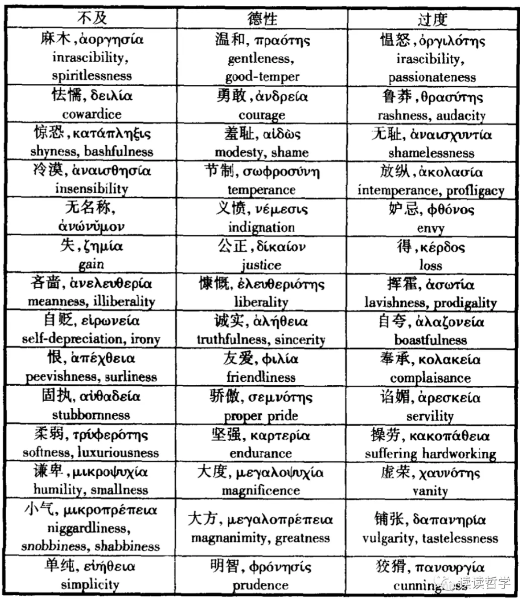

# 2.7 具体的德性引论

## 文本

（《尼各马可伦理学》亚里士多德 著 廖申白 译注 商务印书馆 （2009））

**然而我们不应当只是谈论德性的一般概念，而应当把它应用到具体的事例上去。因为在实践话语中，尽管那些一般概念适用性较广，那些具体陈述的确定性却更大些。实践关乎那些具体的事例，我们的理论也必须同这些事例相吻合。我们可以从我们 的德性表中逐一地讨论。恐惧与信心方面的适度是勇敢。其过度的形式，在无恐惧上的过度无名称（许多品质常常没有名称）， 在信心上过度是鲁莽。快乐和痛苦 -- 不是所有的，尤其不是所有的痛苦-- 一方面的适度是节制，过度是放纵。我们很少见到在快乐上不及的人，所以这样的品质也无其名，不过我们可以称之为冷漠。在钱财的接受与付出方面的适度是慷慨，过度与不及是挥霍和吝啬。这两种人的过度与不及刚好相反：挥霍的人在付出上过度而在接受上不及，吝啬的人则在接受上过度而在付出上不及。我们暂且作这一粗略而概要的说明，就眼下的目的而言这已足够了 。我们还将在后面更缜密地考察这些品质。在钱财方面还有其他一些品质。其中那种适度的品质是大方（大方的人不同于慷慨的人 ，前者与对大笔钱财的处理有关 ，后者只与对小笔钱财的处理有关），其过度形式是无品味或粗俗，不及形式是小气。大方的过度与不及不同于慷慨的过度与不及，我们将在后面谈到这种 区别。荣誉与耻辱方面的适度是大度。其过度形式是人们所说的虚荣 ，不足形式是谦卑。正如慷慨同大方的区别 ，如已说过的，在于它只涉及对小笔钱财的处理一样，也有一种品质以这种方式同大度相联系，而只同对微小的荣誉的处理有关。因为，对微小荣誉的欲求也可以有适度、过度与不及。过度地欲求这种荣誉的人称为爱荣誉者 ，在欲求这种荣誉上不及的人则被称为不爱荣誉者，而欲求得适度的人则无名称。这些品质也都没有名称，只有爱荣誉者的品质被称为好名。结果，那两种极端反倒要占据适度品质的位置。我们自己也有时把有适度品质的人称为爱荣誉者，有时又把他们称为不爱荣誉者；有时称赞爱荣誉的人，有时又称赞不爱荣誉的人。这是什么原因，我们下面将会讨论。不过现在，我们还是先按上面的叙述方式把其他的德性讲完。在怒气方面，也是存在着过度、不足与适度。它们可以说没有名称。不过，既然我们称在怒气上适度的人是温和的人，我们姑且称这种品质是温和。在两种极端的人之中，怒气上过度的人可以被称为愠怒的，这种品质可以称为愠怒；怒气上不足的人可以被称为麻木的，而这种品质也可以称为麻木。此外 ，还有三种品质相互间有些相似，又有所不同。它们都同语言与行为的共同体有关。不过， 一个是关系到这种语言与行为的诚实性， 另两个则关系到语言与行为的愉悦性：其中一个表现于娱乐的愉悦性中，另一个则存在于生活的所有场合中。我们必须对它们加以讨论，以便能更加看清，在所有事务中，适度的品质都会受到称赞 ，而那些极端则既不正确，又不值得称赞，而是应受谴责。大多数这类品质也是无名称的。但是我们必须像在其他那些地方一样 ，尽力地给出它们的名称，以便使我们的讨论明白易懂。在交往的诚实性方面，具有适度品质的人可以被称作诚实的。这种适度的品质也可以称作诚实。在虚伪的品质中，夸大自己的形式可称作自夸，这种人可称作自夸的人。贬低自己的形式可称作自贬，这种人可称作自贬的人。在娱乐的愉悦性方面，具有适度品质的人是机智的，这种品质是机智。过度的品质是滑稽，这种人也就是滑稽的人。具有不及的品质的人是呆板的，这种品质也就称为呆板 。在一般生活的愉悦性方面 ，那种让人愉悦得适度的人是友爱的，这种品质也就是友爱。过度的人，如果是没有目的的，便是谄媚；如果是为得到好处，便是奉承 。那种不及的、在所有这些事务上都令人不愉快的人，则是好争吵的 、乖戾的人 。还有一些适度的品质是感情中的或同感情相关的品质。因为尽管羞耻不是一种德性 ，一个知羞耻的人却受人称赞。在这些事情上 ，我们也说一个人是适度的 ，或者另一个人是过度的。例如，羞怯的人对什么事情都觉得惊恐，而在羞耻上不足的人则对 什么事情都不觉羞耻，具有适度品质的人则是有羞耻心的。此外，义愤是妒忌与幸灾乐祸之间的适度。它们都与我们为邻人的好运所感受的快乐或痛苦有关。义愤的人为邻人的不应得的好运感到痛苦。妒忌的人在痛苦上更盛于义愤的人，他为别人的一切好运都感到痛苦 。而幸灾乐祸的人则完全缺少此种痛苦，而是反过来为邻人的坏运气感到高兴。我们在后面还有机会讨论这些品质。关于公正，由于它是在多种不同意义上使用的，我们将在讨论这些品质之后区分这些意义，并且表明它们各自在何种意义上是适度的品质（ 我们也将以同样的方式讨论逻各斯的德性）。**

## 导读

这一节一一讨论了亚里士多德的德性表上的种种德性。在《欧台谟伦理学》中有一份这样的德性表：

置于两个极端之间的中庸的德性会随着视角的转换而改变面貌：与懦夫相比时，一个勇敢的人会显得鲁莽；与莽夫比起来，勇敢的人会显得懦弱。占据一个极端的任何人都会把中庸推向另一个极端的方向，而要实现亚里士多德所描述的，同时认识到两个极端的三分结构，则需要一个置身事外的观察者的角度。由此对于置身事件当中的人而言，中庸不具备所需要的指导意义，而置身事外的观察者则不需要对中庸的判断来指导行动。通过要求一种全局性的视角来完成对中用的判断，亚里士多德使自己的道德实践陷入一种两难境地。

## 思考的问题

亚里士多德的德性表能够涵盖所有的德性吗？

身处事件当中的人该如何判断行为是否符合中庸？

