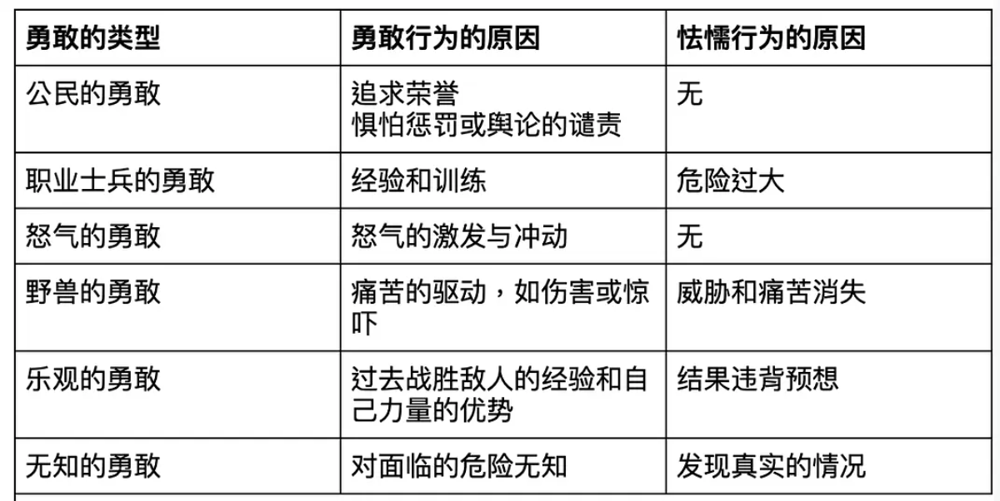

# 3.8 相似于勇敢的其他品质

## 文本

（《尼各马可伦理学》亚里士多德 著 廖申白 译注 商务印书馆 （2009））

**勇敢的性质就是这样。但是，勇敢这个名称也被用到其他五种品质上面。首先是公民的勇敢，它最像是真正的勇敢。公民们承受危险似乎是因为怯懦的行为将会招致法律的惩罚和舆论的谴责，以及勇敢行为将得到荣誉。所以，那些在其中懦夫受到轻蔑、勇敢的人得到荣誉的民族，似乎都是最为勇敢的民族。荷马通过例如狄俄墨得斯和赫克托耳来刻画的也正是这种勇敢：**

**波吕达马斯首先就会责备我；**

**狄俄墨得斯，**

**赫克托耳日后准会在特洛伊城内夸口：**

**“是我把梯丢斯的儿子．．．．．．。**

**这种勇敢与我们在上面描述过的勇敢最为相似。因为，它是出于德性（ 即羞耻感）的，是出于对某种高尚\[高贵\]（ 即荣誉）的欲求和为着躲避某种受人谴责的耻辱的。由军官迫使着这样做的人们的勇敢也可以算作这一类，不过这种勇敢要低一等。因为，它不是出于羞耻，而是出于恐惧，它想躲避的也不是耻辱而是痛苦 。他们的军官迫使他们勇敢作战，例如赫克托耳对他的士兵们说，**

**我要是看到谁在战场上后退，**

**就把他拿去喂狗。**

**还有些将军，把队伍驻扎在阵地，谁后退就鞭打他们，或者在营地的后面挖掘壕沟等等。这些都是强迫的手段。但是，一个人的勇敢不应当出于强迫，而应当出于高尚\[高贵\]。其次，对某些特殊事务的经验也被当作勇敢。所以苏格拉底就认为勇敢是知识。另外一种这类勇敢则表现在各种境遇，特别是职业士兵的特殊的战争经历中。因为在战争中有许多伪诈，对于这些伪诈，只有那些职业士兵才最有机会去经历。所以，他们显得勇敢是因为别人不了解这些事务的性质。经验还使得他们善于攻防，因为他们善用武器，并且配备有最好的攻防武器。所以在作战时，他们就像拿武器的人在对付徒手的人，像训练有素的运动员在对付生手。因为，即使是在比武上，最好的战士也不是最勇敢的人，而是最强壮、最有训练的人。然而，当危险过大或者对方在人数和装备上过于占优势时，职业士兵就会变得怯懦。因为他们总是最先逃跑 ，而公民士兵则战死在岗位上，就像赫尔墨斯神庙战斗中的情形。因为对公民士兵来说，逃跑是耻辱的，他们宁愿战死也不愿逃跑而生还。而职业士兵从一开始就是依赖于他们的力量上的优势，所以一旦了解了真实情况他们就会逃跑。他们惧怕死甚于惧怕耻辱。这不是真正的勇敢。第三，怒气也被人们算作勇敢。一个人被一种怒气激发时，就像一头在冲向射伤它的猎手的野兽。这种人被认为是勇敢的。因为勇敢的人都具有一种怒气。怒气首先就是冲向危险的热情。所以荷马写道，“他的力量在于愤怒” ，“唤起他们的力量与怒火” ，“他怒火满腔” ，“热血沸腾” 。因为所有这些都表现着怒气的激发与冲动。而勇敢的人则是由于高尚\[高贵\]而勇敢，尽管怒气也提高着他们的勇敢。另一方面 ，野兽是由于痛苦的驱动而行动的。它们攻击人是因为它们受到伤害或惊吓。因为如果它们处于森林（或沼泽）中就不会去攻击人。所以野兽算不得勇敢。因为，当它们由于伤痛而冲向危险时，它们并未预见到它们要遭遇的危险。如果这也是勇敢，那么驴在饥饿的时候就也是勇敢的了。因为，不论你怎么抽打它们 ，它们也不会离开食物。（通奸者们由于欲望也会做出许多大胆的事情 。）但是，由怒气激发起来的勇敢又似乎是最为自然的勇敢，如果再加上选择或目的，那就是真正的勇敢了。人也是愤怒时就痛苦，报复时就快乐。但是，出于这样的情形的人尽管骁勇，却算不得勇敢。因为他们的行动不是出于高尚\[高贵\]，出于逻各斯，而是出于感情。但是，他们和勇敢的人又有些相似。第四，乐观的人也算不得勇敢。因为，他们是由于多次地战胜了敌人才在危险时刻抱有信心的。不过，他们同勇敢的人很相似，因为这两种人都有信心。勇敢的人有信心是由于前面说过的原因。而乐观的人有信心则是由于己方力量的优势和无遭受痛苦之虞（ 喝醉酒的人的行为也和这差不多，因为醉酒使得他们乐观）。当结果有违于他们的预想时，他们就会逃跑。而勇敢的人，如已说过的，则敢于面对对于人来说是或显得是可怕的事物，因为这样做是高尚\[高贵\]，不这样做是耻辱。所以，面对突发的危险表现出无畏惧和不受纷扰似乎比在所预见的危险面前的此种表现更是勇敢。前种表现更加是出于品质的，因为它无法事先准备。面对己预见到的危险而如此表现，可以是出于推断和逻各斯的，而面对突发的危险而如此表现则必定是出于品质的。最后，对所面临的危险无知的人也显得勇敢。这种人同乐观的人有些相似，但是不及乐观的人，因为他们不具备自信。所以乐观的人还可以坚持一段时间，而被假象欺骗的无知者如果发现或怀疑情况不是他们所想象的那样，就会溜掉，就像阿尔戈斯人在错把斯巴达人当作了西锡安人时所做的那样。关于勇敢的人的特点和那些被当作了勇敢的人的特点，我们就已经说完了。**

## 导读

在这一节，亚里士多德讨论了其他看似勇敢，但并非真正的勇敢的品质。这些品质大致可以总结如下：

由这些与勇敢接近，但并非勇敢的品质中，我们可以看出亚里士多德对勇敢的要求。首先，勇敢的人在任何情况下都不会采取怯懦的行为，这一点与公民的勇敢和怒气的勇敢相似。其次，勇敢的行为必须是在了解真实的情况下做出的，包括对危险和对自己和对方实力的正确认识。再次，勇敢必须是出于高尚的目的，这一点被亚里士多德反复强调，而从公民勇敢的例子中我们可以看出，出于荣誉的目的仅仅是高尚目的的一种，而非全部。最后，勇敢的行为是出于主动的选择的，而非被迫或来自痛苦的驱动。

在亚里士多德看来，追求高尚目的而做出的行为，高于躲避痛苦而做出的行为。但当一个人宁可选择死亡也要避免羞辱，这种行为究竟是出于对荣誉的追求，还是对羞辱的恐惧？在我们的日常选择中，是否存在这种能够截然分开的动机？或者更广泛地说，为什么动机在亚里士多德的伦理学体系中如此重要？

## 思考的问题

你认为这一节里所谈论的类似勇敢的品质是由高到低排列的吗？如果是的话，这种排列的标准是什么？

在亚里士多德看来，逃避痛苦似乎比逃避羞辱更为不齿。为什么？

亚里士多德为什么说怒气加上选择或目的就是真正的勇敢？

为什么动机在亚里士多德的伦理学体系中占有重要地位？

