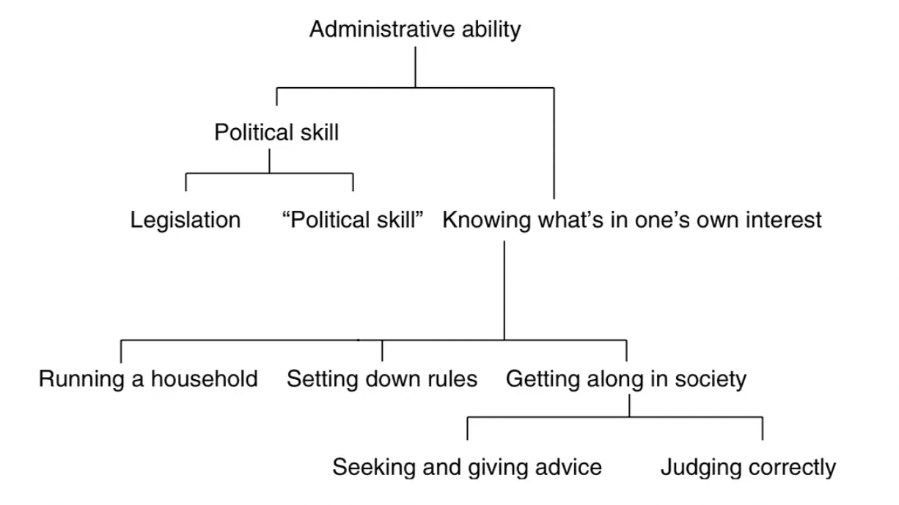

# 6.8 明智的种类

## 文本

（《尼各马可伦理学》亚里士多德 著 廖申白 译注 商务印书馆 （2009））

**政治学和明智是同样的品质，虽然它们的内容不一样。城邦事务方面的明智，一种主导性的明智是立法学，另一种处理具体事务的，则独占了这两者共有的名称，被称作政治学。处理具体事务同实践和考虑相关（因为法规最终要付诸实践）。所以，人们只是把那些处理具体事务的人说成是在“参与政治”，因为只有他们才像工匠那样地活动。明智也常常被理解为同一个人自己相关。一般所说的明智就指的是这种。但是它其实包括所有这些种类，其他的种类有理财学、立法学和政治学。政治学又包括考虑的明智和裁决的明智。知道对自己而言的善是什么无疑是一种明智，尽管它同其他的那些明智十分不同。而且，人们都认为，知道并关心自己的利益的人很明智，而政治家们都是些忙忙碌碌的人。所以欧里庇德斯说，**

**我混迹于大众，享受一份平等的自由，**

**就算是明智？**

**那些整日忙碌不休的人......**

**因为人们都追求他们的利益，并且觉得这样对。于是就有了这样的意见，那些关心自己的所得的人就是明智的人。但事实上，一个人的善离开了家庭和城邦就不存在。而且，即使是个人的事务，要掌握得好也不容易，也需要研究。另一个证明就是，青年人可以在几何和数学上学习得很好，可以在这些科目上很聪明，但是我扪在他们身上却看不到明智。这原因就在于，明智是同具体的事情相关的，这需要经验，而青年人缺少经验。因为，经验总是日积月累的。（还可以再研究一下：青年人何以能成为一个数学家，却不能有智慧，也不能成为通晓自然的人。也许其原因就在于，数学只是抽象，那些始点则得自经验；青年人可以咏诵表达着始点的词句然而不相信它们，而数学的知识内容则是明明白白的）此外，在考虑上可能发生两种错误：或在普遍知识方面发生错误，或在具体内容方面发生错误。例如，一个人可能会说，所有的重水都无益健康，也可能会说这种水是重水。**

**其次，明智显然不是科学。因为，如已说明的，明智是同具体的东西相关的，因为实践都是具体的。明智是努斯的相反者。因为，努斯相关于始点，对这些始点是讲不出逻各斯来的。明智则相关于具体的事情，这些具体的东西是感觉而不是科学的对象。不过这不是说那些具体感觉，而是像我们在判断出眼前的一个图形是三角形时的那种感觉。因为，在这种感觉中也有一个停止点。然而这种感觉更靠近的是感觉而不是明智，尽管它是不同于具体感觉的另一种感觉。**

## 导读

在 Michael Pakaluk 的Aristotle’s Nicomachean Ethics an Introduction 中，作者将明智的类别划分如下：

同《伦理学》最初的设定一样，亚里士多德将明智划分为城邦之善和个人之善。城邦之善包括立法学和政治学，前者设立规则，后者处理具体事物的实践。而与个人事务相关的明智也可以划分为三类，包括理财，设定规则，和属人意义上的政治学，其关注点在于人与社会的关系。这种个人意义上的政治学又分为考虑的明智和裁决的明智。

政治学在个人和城邦层面的双重意义，与亚里士多德认为个人和城邦不可分割的观点是一致的。处理城邦事务和处理个人事务有一种相似性，也都需要类似的明智。明智需要经验，以及在普遍和具体方面的知识。这些经验和知识需要时间才能掌握，因此在年轻人身上很少发现明智。

## 思考的问题

明智与科学、智慧和努斯的关系是什么？

